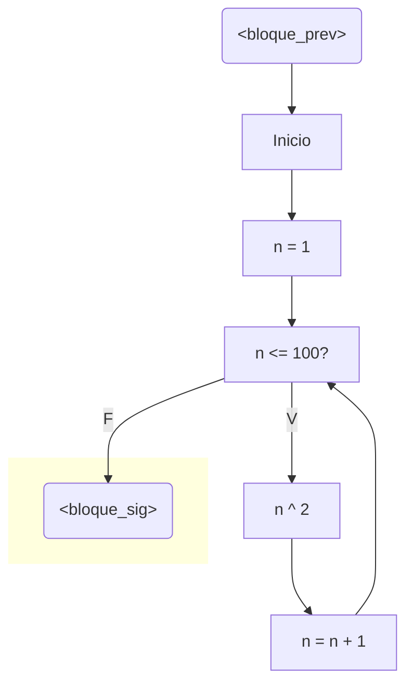
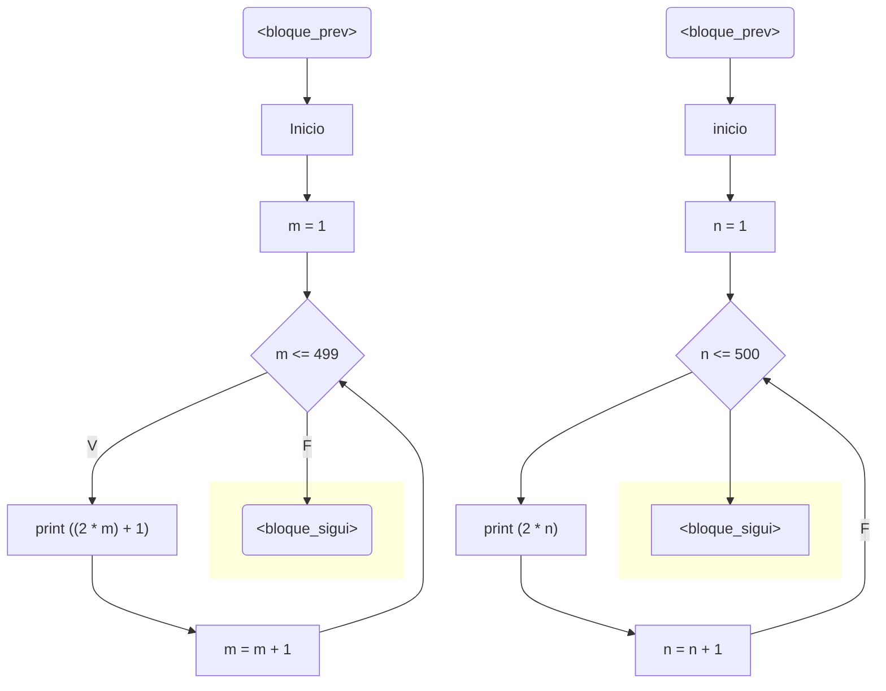
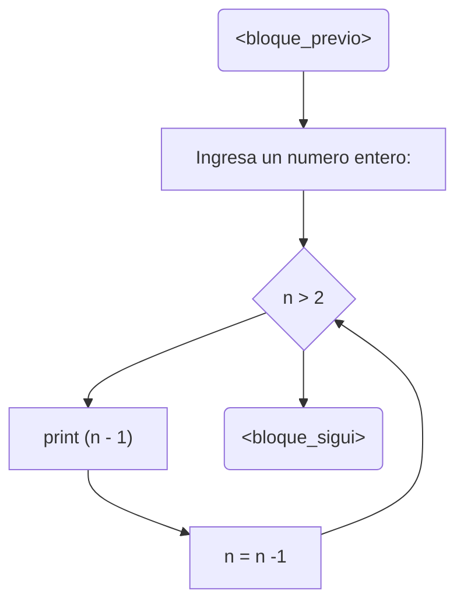

# reto6_Nicolas_Alejandro_Monroy_Gomez

## Reto 6
Para este reto 6 hay que desarrollar estos 6 puntos en un notebook de python, el cual estará adjuntado en este repo. Los 3 primeros puntos deben tener diagramas de flujo y además, el código debe ir debidamente documentado.

1. Imprimir un listado con los números del 1 al 100 cada uno con su respectivo cuadrado.

2.  Imprimir un listado con los números impares desde 1 hasta 999 y seguidamente otro listado con los números pares desde 2 hasta 1000.

3.  Imprimir los números pares en forma descendente hasta 2 que son menores o iguales a un número natural n ≥ 2 dado.

4. Imprimir el factorial de un número natural n dado.
5. Implementar un programa que ingrese un número de 2 a 50 y muestre sus divisores.
6. Implementar el algoritmo que muestre los números primos del 1 al 100. **Nota:** use funciones
